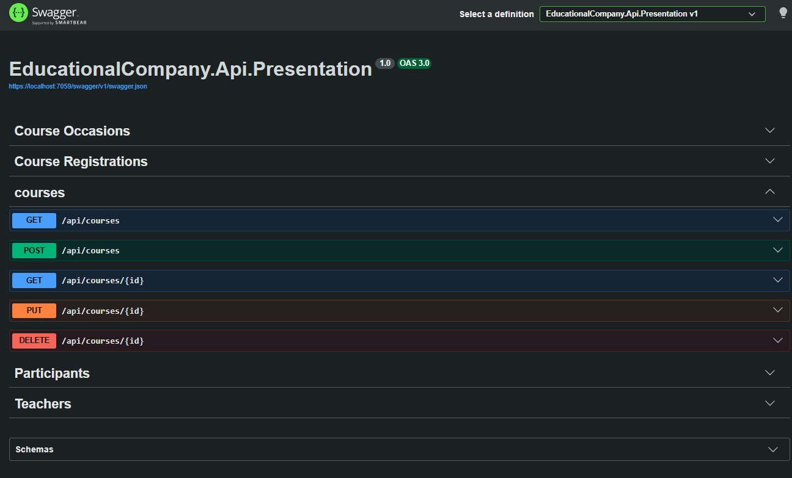
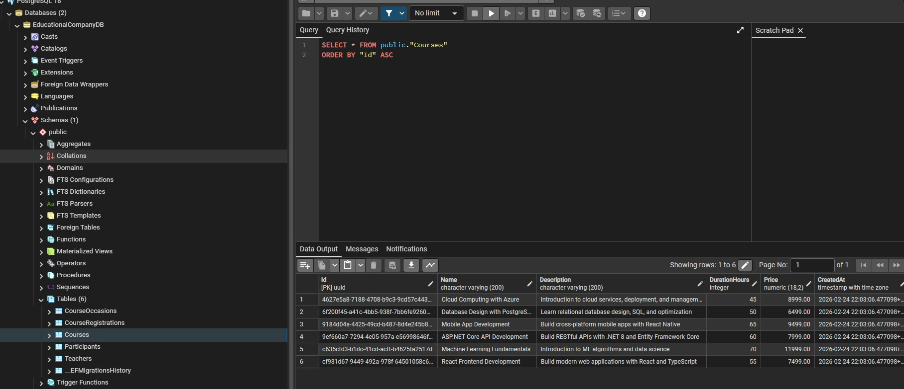
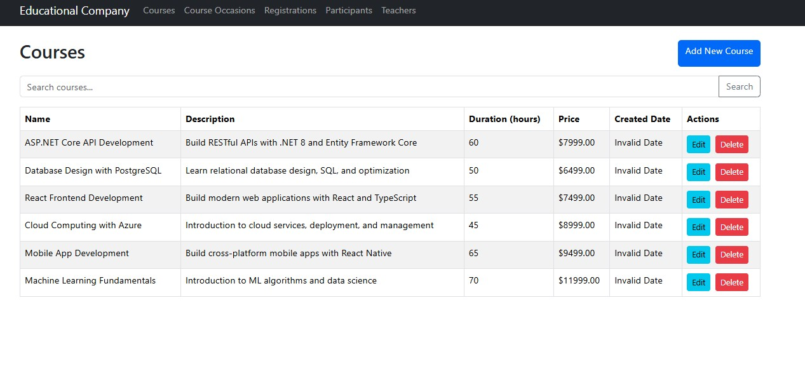

# 🛠️ EducationalCompany.Api

A production-structured ASP.NET Core Web API built with C# and .NET 10, implementing Clean Architecture principles, Entity Framework Core (PostgreSQL), Unit of Work, caching, and automated testing.

This API powers the EducationalCompany system and manages Courses, Course Occasions, Participants, Teachers, and Registrations.

---

# 🌍 Full System

This backend is part of a full-stack system.

👉 Frontend Repository:  
https://github.com/mriadalrashed/EducationalCompany.Portal

Frontend (React + Vite)  
⬇  
ASP.NET Core Minimal API  
⬇  
PostgreSQL Database

---

# 📸 System Preview

## 📡 Swagger API Documentation


## 🗄️ PostgreSQL Database (EF Core Code-First)


## 📊 Sample Data View


---

# 🧭 System Overview

EducationalCompany.Api is structured using a layered architecture to ensure:

- Separation of concerns
- Testability
- Maintainability
- Scalability
- Domain integrity

The system exposes RESTful endpoints using ASP.NET Core **Minimal APIs**.

---

# 🏗️ Architecture

The solution is organized into multiple projects:

```
EducationalCompany.Api/
│
├── Domain
├── Application
├── Infrastructure
├── Presentation
└── Tests
```

---

## 📦 Domain Layer

Contains:

- Core entities
- Business rules
- Domain logic
- BaseEntity (CreatedAt / UpdatedAt tracking)

### Entities

- Course
- CourseOccasion
- CourseRegistration
- Participant
- Teacher

### Domain Logic Highlights

- CourseOccasion tracks:
  - MaxParticipants
  - CurrentParticipants
  - IsFull state
- Registration lifecycle:
  - Pending (default)
  - Confirm()
  - Cancel()
- Domain methods enforce invariants (not just data containers)

---

## 📦 Application Layer

Responsible for:

- DTOs
- Service interfaces
- Business use-case orchestration
- Dependency Injection configuration (`AddApplicationServices()`)

This layer isolates business logic from infrastructure concerns.

---

## 📦 Infrastructure Layer

Responsible for:

- Entity Framework Core configuration
- PostgreSQL provider (Npgsql)
- Repository implementations
- Unit of Work pattern
- Memory caching (IMemoryCache)

### Database

- EF Core 10
- PostgreSQL
- Code-First approach
- Automatic migration at startup:
  ```csharp
  dbContext.Database.Migrate();
  ```

### Relationships

- Course → CourseOccasion (Cascade delete)
- CourseOccasion → Teacher (SetNull)
- Unique index on Registration (Participant + Occasion)

---

## 📦 Presentation Layer

Uses **Minimal APIs** instead of Controllers.

Endpoints are organized by domain and mapped via extension methods.

### CORS Policy

Configured for frontend development:

```
http://localhost:5173
```

### Swagger

Swagger/OpenAPI enabled for API exploration.

Available at:

```
https://localhost:<port>/swagger
```

---

# 📡 API Endpoints

## Courses — `/api/courses`

- GET `/`
- GET `/{id}`
- POST `/`
- PUT `/{id}`
- DELETE `/{id}`

---

## Course Occasions — `/api/course-occasions`

- GET `/`
- GET `/upcoming`
- GET `/{id}`
- GET `/{id}/with-registrations`
- GET `/course/{courseId}`
- GET `/{id}/is-full`
- POST `/`
- PUT `/{id}`
- PUT `/{id}/assign-teacher`
- DELETE `/{id}`

---

## Registrations — `/api/registrations`

- GET `/`
- GET `/{id}`
- GET `/{id}/details`
- GET `/participant/{participantId}`
- GET `/occasion/{occasionId}`
- POST `/`
- PUT `/{id}/status`
- PUT `/{id}/confirm`
- PUT `/{id}/cancel`
- DELETE `/{id}`

---

## Participants — `/api/participants`

- GET `/`
- GET `/{id}`
- GET `/{id}/with-registrations`
- POST `/`
- PUT `/{id}`
- DELETE `/{id}`

---

## Teachers — `/api/teachers`

- GET `/`
- GET `/{id}`
- GET `/{id}/with-occasions`
- POST `/`
- PUT `/{id}`
- DELETE `/{id}`

---

# 🧪 Testing Strategy

Testing project includes:

- xUnit
- Moq
- FluentAssertions
- Shouldly
- EFCore.InMemory
- Coverlet (code coverage)

Test coverage includes:

- Unit tests for services
- Integration tests for repositories
- Domain logic validation
- Test fixtures and factory patterns

---

# ⚙️ Running the Application

## 1️⃣ Configure Database

Update:

```
appsettings.json
```

⚠️ For production, use environment variables instead of hardcoding credentials.

---

## 2️⃣ Run the API

```bash
dotnet restore
dotnet run --project EducationalCompany.Api.Presentation
```

---

# 🏗️ Engineering Highlights

- Minimal APIs architecture
- Clean layered separation
- Unit of Work pattern
- Repository abstraction
- EF Core 10 with PostgreSQL
- Automatic migrations
- Domain-driven design principles
- Caching via IMemoryCache
- Comprehensive automated testing suite

---

# 🔮 Future Improvements

- JWT Authentication & Authorization
- Global exception handling middleware
- Structured logging (Serilog)
- API versioning
- Health checks
- Docker containerization
- CI/CD pipeline
- Production environment hardening

---

## 🤖 AI Usage Disclosure

AI tools were used as a productivity aid during development, particularly for refining code comments and improving documentation clarity, as well as assisting in structuring unit and integration tests.

All implementation, architectural decisions, and final validation were performed and reviewed by the project author to ensure correctness and full technical understanding.


---

## 📘 About This Project

Developed as part of an academic software engineering course, this project demonstrates practical proficiency in C#, PostgreSQL database design, Clean Architecture principles, domain-driven design concepts, and automated testing strategies.
---


## 📄 License

This project is for academic and educational purposes only.
